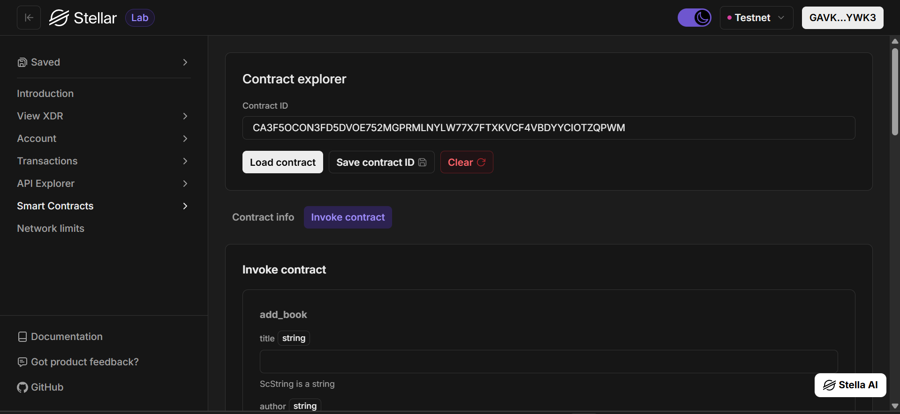
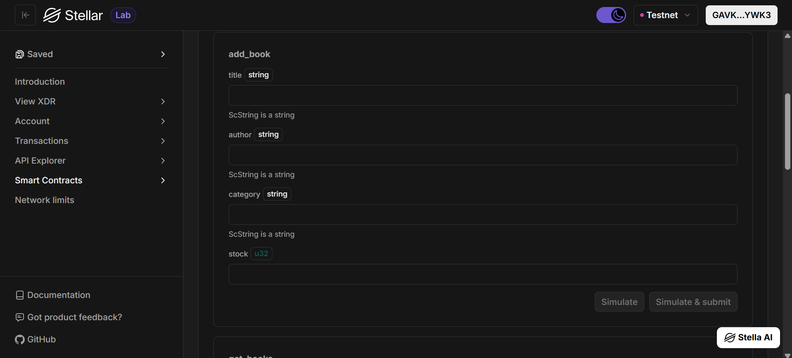
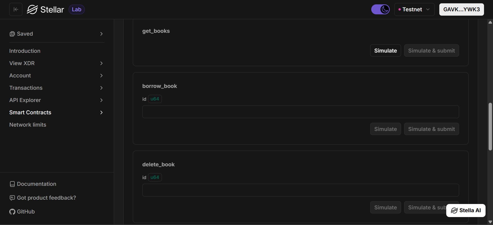
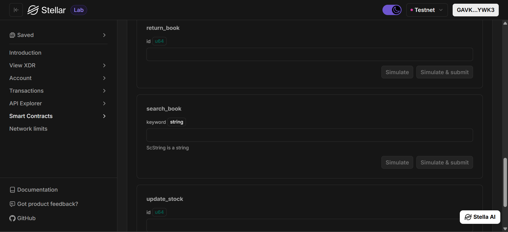
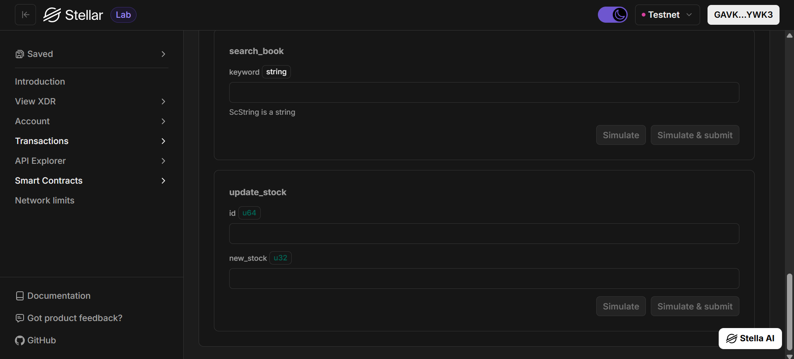

# Stellar Inventory DApp

**Stellar Inventory DApp** - Blockchain-Based Book Inventory Management System

---

## Project Description

Stellar Inventory DApp is a decentralized smart contract solution built on the Stellar blockchain using Soroban SDK. It provides a secure and transparent platform for managing book inventory directly on the blockchain.

This system allows users to add, view, update, delete, borrow, return, and search book records without relying on centralized databases. Each book is uniquely identified and stored in the smart contract’s instance storage, ensuring data integrity, persistence, and tamper-proof management.

The application simulates a more realistic inventory and library system, supporting stock management and borrowing mechanisms on-chain.

---

## Project Vision

Our vision is to modernize inventory management systems by:

- **Decentralizing Inventory Data**: Eliminating dependency on centralized servers  
- **Ensuring Data Integrity**: Preventing unauthorized modifications through blockchain immutability  
- **Enhancing Transparency**: Making all inventory transactions verifiable on-chain  
- **Empowering Ownership**: Giving users full control over their inventory data  
- **Building Trustless Systems**: Ensuring reliability through smart contract logic instead of intermediaries  

We aim to create a system where inventory data is secure, reliable, and globally accessible without compromise.

---

## Key Features

### 1. Book Management
- Add new books with title, author, category, and stock  
- Automatically generate unique IDs for each book  
- Store book data permanently on the blockchain  

### 2. Inventory & Stock Control
- Track available stock for each book  
- Prevent invalid stock updates  
- Ensure stock never goes below zero  

### 3. Borrow & Return System
- Borrow books (automatically reduces stock)  
- Return books (automatically increases stock)  
- Prevent borrowing when stock is empty  

### 4. Search Functionality
- Search books by title  
- Quickly filter relevant books  
- Improve data accessibility  

### 5. Data Retrieval
- Retrieve all stored books in a single function call  
- Structured data format for frontend integration  
- Real-time synchronization with blockchain state  

### 6. Book Deletion
- Remove books using their unique ID  
- Efficient storage management  
- Immediate update after deletion  

### 7. Transparency & Security
- All transactions recorded on the blockchain  
- Immutable and tamper-proof data  
- Protection against unauthorized changes  

### 8. Stellar Network Integration
- Fast and low-cost transactions  
- Built using Soroban Smart Contract SDK  
- Scalable for growing inventory needs  

---

## Contract Details

- **Contract Address**:  
`CA3F5OCON3FD5DVOE752MGPRMLNYLW77X7FTXKVCF4VBDYYCIOTZQPWM`

---

## Technical Requirements

- Rust Programming Language  
- Soroban SDK  
- Stellar Blockchain Network  

---

## Getting Started

Deploy the smart contract to Stellar’s Soroban network and interact with the main functions:

- `add_book()` → Add a new book  
- `get_books()` → Retrieve all books  
- `delete_book()` → Delete a book by ID  
- `update_stock()` → Update stock  
- `borrow_book()` → Borrow a book (reduce stock)  
- `return_book()` → Return a book (increase stock)  
- `search_book()` → Search books by title  

---

## Testnet Screenshot











---

## Data Structure

```rust
pub struct Book {
    id: u64,
    title: String,
    author: String,
    category: String,
    stock: u32,
}